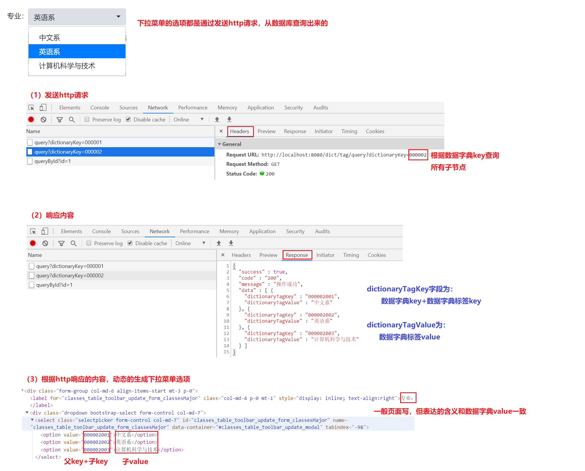

# 图书管理系统

## 项目目标

+ 数据库相关知识：数据库设计、基本CRUD操作，关联查询操作，JDBC操作
+ Servlet处理HTTP请求
+ HTTP相关知识：请求方法、响应状态码、数据类型等

## 开发环境与技术栈

+ Windows
+ Maven
+ Servlet
+ MySQL
+ Jackson

## 项目功能

主要业务：管理学校图书信息，记录并管理学生借阅图书信息

+ 用户登录、会话管理
+ 图书借阅信息管理（可实现部分）

## 项目演示

### 用户登录


+ 借阅信息查询


+ 新增借阅信息


+ 修改借阅信息


+ 删除借阅信息


## 数据库设计
### 数据库表关系图


### 字典表说明

数据字典表和数据字典标签表主要用在一些通用的下拉菜单选项。

如班级表中的字段：学生是哪一届的，学生专业

+ 如果单独设计需要单独一张表，实际存放的数据也不会太多，可以考虑设计在整体的一张表。
+ 页面上展示时，这些字段也是下拉选项。
+ 一般在设计上考虑为两张表：数据字典表和数据字典标签表（一对多关系）来保存。两张表都是key、value的形式，字典表是父节点，字典标签表是子节点，下拉菜单通过父节点的key查询出所有关联的子节点，再使用子节点的key、value进行下拉菜单选项的初始化

比如一个下拉菜单，页面元素-接口请求/响应-数据库关系如下：



## 前后端接口

要实现功能，需要先明确前后端约定好的接口，我们主要实现图书借阅信息管理，所以只实现该业务相关接口。

需要说明的是，接口的定义一般是前后端约定好的，所以也和前端代码息息相关，前端需要什么数据，需要什么格式的数据，也会在接口中体现。

### 查询专业字典

请求

```
GET dict/tag/query?dictionaryKey=000002
```

响应

```json
{
  "success" : true,
  "code" : "200",
  "message" : "操作成功",
  "data" : [ {
    "dictionaryTagKey" : "000002001",
        "dictionaryTagValue" : "中文系"
  }, {
    "dictionaryTagKey" : "000002002",
    "dictionaryTagValue" : "英语系"
  }, {
    "dictionaryTagKey" : "000002003",
    "dictionaryTagValue" : "计算机科学与技术"
  } ]
}
```

### 查询毕业年份字典

请求

```
GET dict/tag/query?dictionaryKey=000001
```

响应

```json
{
  "success" : true,
  "code" : "200",
  "message" : "操作成功",
  "data" : [ {
    "dictionaryTagKey" : "000001001",
    "dictionaryTagValue" : "2020届"
  }, {
    "dictionaryTagKey" : "000001002",
    "dictionaryTagValue" : "2021届"
  }, {
    "dictionaryTagKey" : "000001003",
    "dictionaryTagValue" : "2022届"
  }, {
    "dictionaryTagKey" : "000001004",
    "dictionaryTagValue" : "2023届"
  } ]
}
```

### 查询图书借阅信息

请求

```
GET borrowRecord/query?searchText=&sortOrder=asc&pageSize=7&pageNumber=1
```

响应

```json
{
  "success" : true,
  "code" : "200",
  "message" : "操作成功",
  "total" : 9,
  "data" : [ {
    "id" : 1,
    "startTime" : "2020-01-01 14:20:00",
    "endTime" : "2020-02-01 14:20:00",
    "createTime" : "2020-06-17 15:52:33",
    "book" : {
      "id" : 1,
      "bookName" : "高等数学",
      "author" : "马拉司机",
      "price" : 115.20
    },
    "classes" : {
      "id" : 1,
      "classesName" : "幼儿园\uD83D\uDE02大班",
      "classesGraduateYear" : "000001001",
      "classesMajor" : "000002002",
      "classesDesc" : "已经4岁，即将成为大人的大班同学，不再是3岁小孩子了呀"
    },
    "student" : {
      "id" : 1,
      "studentName" : "小小的梦想\uD83D\uDC37A1",
      "studentNo" : "s00001",
      "idCard" : "222222222222222222",
      "studentEmail" : "123@qq.com"
    }
  }, {
    "id" : 7,
    "startTime" : "2020-02-01 14:20:00",
    "endTime" : "2020-02-21 14:20:00",
    "createTime" : "2020-06-17 15:52:33",
    "book" : {
      "id" : 3,
      "bookName" : "柴米油盐",
      "author" : "家庭妇男",
      "price" : 33.00
    },
    "classes" : {
      "id" : 1,
      "classesName" : "幼儿园\uD83D\uDE02大班",
      "classesGraduateYear" : "000001001",
      "classesMajor" : "000002002",
      "classesDesc" : "已经4岁，即将成为大人的大班同学，不再是3岁小孩子了呀"
    },
    "student" : {
      "id" : 3,
      "studentName" : "小小的梦想\uD83D\uDC37A3",
      "studentNo" : "s00003",
      "idCard" : "222222222222222224",
      "studentEmail" : "123@qq.com"
    }
  } ]
}
```

### 查询班级（数据字典）

使用在下拉菜单中，要求按照数据字典响应格式返回

请求
```
GET http://localhost:8080/classes/queryAsDict
```

响应
```json
{
  "success" : true,
  "code" : "200",
  "message" : "操作成功",
  "data" : [ {
    "dictionaryTagKey" : "1",
    "dictionaryTagValue" : "幼儿园\uD83D\uDE02大班",
    "classesGraduateYear" : "000001001",
    "classesMajor" : "000002003"
  }, {
    "dictionaryTagKey" : "2",
    "dictionaryTagValue" : "幼儿园\uD83D\uDE02中班",
    "classesGraduateYear" : "000001002",
    "classesMajor" : "000002003"
  }, {
    "dictionaryTagKey" : "3",
    "dictionaryTagValue" : "幼儿园\uD83D\uDE02小班",
    "classesGraduateYear" : "000001003",
    "classesMajor" : "000002003"
  } ]
}
```

### 查询图书（数据字典）

使用在下拉菜单中，要求按照数据字典响应格式返回

请求

```
GET book/queryAsDict
```

响应

```json
{
  "success" : true,
  "code" : "200",
  "message" : "操作成功",
  "data" : [ {
    "dictionaryTagKey" : "1",
    "dictionaryTagValue" : "高等数学",
    "author" : "马拉司机",
    "price" : 115.20
  }, {
    "dictionaryTagKey" : "2",
    "dictionaryTagValue" : "诗和远方",
    "author" : "老湿",
    "price" : 61.50
  }, {
    "dictionaryTagKey" : "3",
    "dictionaryTagValue" : "柴米油盐",
    "author" : "家庭妇男",
    "price" : 33.00
  }, {
    "dictionaryTagKey" : "4",
    "dictionaryTagValue" : "▄︻┻┳═一∵∴∷∶∵(∵_,∵)>>>>散弹发射！！",
    "author" : "蚷神",
    "price" : 33.00
  } ]
}
```

### 查询学生（数据字典）

级联下拉菜单：选择班级下拉选项之后，根据选择的班级id查询所有学生。要求按照数据字典响应格式返回

请求

```
GET student/queryAsDict?dictionaryKey=2
```

响应

```json
{
  "success" : true,
  "code" : "200",
  "message" : "操作成功",
  "data" : [ {
    "dictionaryTagKey" : "6",
    "dictionaryTagValue" : "小小的梦想\uD83D\uDC37B1",
    "studentNo" : "s00006",
    "idCard" : "222222222222222227"
  }, {
    "dictionaryTagKey" : "7",
    "dictionaryTagValue" : "小小的梦想\uD83D\uDC37B2",
    "studentNo" : "s00007",
    "idCard" : "222222222222222228"
  } ]
}
```

### 新增图书借阅信息

请求

```
POST borrowRecord/add
Content-Type: application/json

{"studentId":"7","bookId":"3","startTime":"2020-06-10 19:40:56","endTime":""}
```

响应

```json
{
  "success" : true,
  "code" : "200",
  "message" : "操作成功"
}
```

### 删除图书借阅信息

请求

```
GET borrowRecord/delete?ids=2&ids=3
```

响应

```json
{
  "success" : true,
  "code" : "200",
  "message" : "操作成功"
}
```

### 查询图书借阅详情

请求

```
GET borrowRecord/queryById?id=1
```

响应

```json
{
  "success" : true,
  "code" : "200",
  "message" : "操作成功",
  "data" : {
    "id" : 1,
    "startTime" : "2020-01-01 14:20:00",
    "endTime" : "2020-02-01 14:20:00",
    "createTime" : "2020-06-17 15:52:33",
    "book" : {
      "id" : 1,
      "bookName" : "高等数学",
      "author" : "马拉司机",
      "price" : 115.20
    },
    "classes" : {
      "id" : 1,
      "classesName" : "幼儿园\uD83D\uDE02大班",
      "classesGraduateYear" : "000001001",
      "classesMajor" : "000002002",
      "classesDesc" : "已经4岁，即将成为大人的大班同学，不再是3岁小孩子了呀"
    },
    "student" : {
      "id" : 1,
      "studentName" : "小小的梦想\uD83D\uDC37A1",
      "studentNo" : "s00001",
      "idCard" : "222222222222222222",
      "studentEmail" : "123@qq.com"
    }
  }
}
```

### 修改图书借阅信息

请求

```
POST borrowRecord/update
Content-Type: application/json

{"id":"10","studentId":"3","bookId":"4","startTime":"2020-06-11 19:24:46","endTime":"2020-06-18 19:54:49"}
```

响应

```json
{
  "success" : true,
  "code" : "200",
  "message" : "操作成功"
}
```

## 代码设计

### 设计http请求基类

主要针对前端表格中，可以输入文本搜索，并根据页码显示列表数据

```java
import lombok.Getter;
import lombok.Setter;

@Getter
@Setter
public class BaseEntity {

    private Integer pageNumber;

    private Integer pageSize;

    private String searchText;

    private String sortOrder;
}

```

### 设计统一响应类

```java
import com.github.pagehelper.Page;
import lombok.Getter;
import lombok.Setter;
import lombok.ToString;

import java.io.PrintWriter;
import java.io.StringWriter;

@Getter
@Setter
@ToString
public class ResponseResult {

    private boolean success;

    private String code;

    private String message;

    private Long total;

    private Object data;

    private String stackTrace;
}
```

### 分页

利用ThreadLocal这个类进行参数传递，在一些特定的场景下，需要传递参数：保存每个线程绑定的数据，在需要的地方可以直接进行获取，在同一线程中的任何地方都可以直接获取，而不是仅仅局限于一个方法或者一个类中